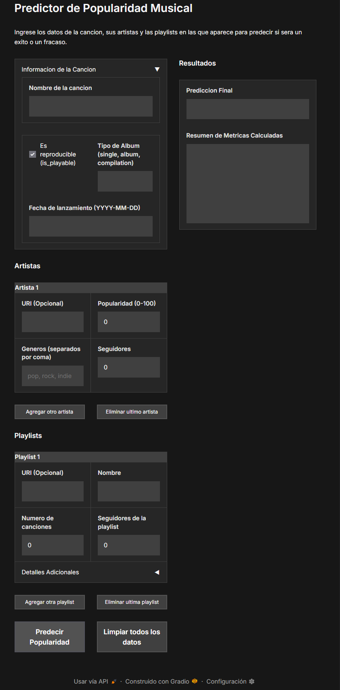

# Music Popularity Prediction on Spotify Through Analysis of Its Data and Machine Learning

## Overview
This project analyzes data obtained from the Spotify platform, examines its behavior, and identifies patterns within it in order to apply a Machine Learning algorithm that can predict whether a song is likely to achieve mainstream success or not, based solely on an understanding of its musical characteristics, information about its composers, and additional Spotify metrics.

## Table of Contents
1. [Key Highlights](#key-highlights)
2. [Objectives](#objectives)
3. [Technologies Used](#technologies-used)
4. [Installation and Setup](#installation-and-setup)
5. [Architecture](#architecture)
6. [Dataset](#dataset)
7. [Methodology](#methodology)
8. [Initial Results](#initial-results)
9. [Final Results and Conclusions](#final-results-and-conclusions)
10. [Model Interface Implementation](#model-interface-implementation)
11. [Repository Structure](#repository-structure)
12. [Authors](#authors)

## Key Highlights

- Integrated dataset with more than 200,000 songs.
- Final Accuracy: ~80%.
- Final MCC: ~0.55.
- Most important variables:
  - Average artist popularity.
  - Average followers.
  - Playlist followers.
- Interactive application developed with Gradio.

## Objectives
1. Analyze the relationships that exist among the technical characteristics of songs.

2. Identify patterns and musical trends present in the songs and artists within the dataset.

3. Determine which musical characteristics influence the popularity of a song.

4. Analyze the relationship between artists and the performance of their songs.

5. Build predictive models to estimate the popularity or potential success of a song based on its musical characteristics.

### Questions to Address

#### Popularity
* Is the popularity of a song related to its danceability level?
* Do more energetic songs tend to be more popular?
* Is there a combination of features that favors greater popularity?
* Does the duration of a song influence its popularity?
* Does popularity depend more on the artist or on the musical characteristics?
* Which musical factors influence a song’s popularity the most?
* Are there characteristic musical profiles among the most successful artists?

#### Musical Characteristics
* Are there natural groups of songs with similar characteristics?
* Which characteristics show the strongest correlations?
* Do songs with high danceability also tend to have high energy?
* Is there a relationship between valence (emotional positivity) and popularity?
* Which variables best explain the musical variability in the dataset?
* Is it possible to identify genres or styles solely from acoustic characteristics?

#### Artists
* Do artists maintain a consistent musical style across their songs?
* Are there artists that stand out clearly by certain musical characteristics?
* Which artists show greater musical diversity?
* Do popular artists produce songs with similar characteristics?

#### Predictions
* Is it possible to predict the popularity of a song using only its musical characteristics?
* Which variables are most important in the predictive model?
* Which algorithm offers the best performance for estimating popularity?
* Can a song be classified as a “success” or “failure” using machine learning?
* Can a Machine Learning model predict the commercial success of a song before its release?

## Technologies Used

The project was developed using tools focused on data analysis, machine learning, and interactive application development.

| Technology | Use within the project |
| --- | --- |
| Python 3.12 | Primary language for analysis, modeling, and application development. |
| Pandas | Data cleaning, transformation, and manipulation. |
| NumPy | Mathematical operations and numerical processing. |
| Matplotlib | Data visualization and generation of exploratory charts. |
| Seaborn | Visual statistical analysis and exploration of relationships between variables. |
| Scikit-Learn | Implementation of Machine Learning algorithms and model evaluation. |
| XGBoost | Development of models based on Gradient Boosting. |
| UMAP | Dimensionality reduction and visualization of clusters present in the data. |
| Gradio | Development of the graphical interface for making predictions. |
| Joblib | Serialization and storage of trained models. |
| Jupyter Notebook | Development of exploratory analysis and experimentation. |
| Mermaid | Creation of architecture and workflow diagrams. |
| Git and GitHub | Version control and repository management. |

## Installation and Setup

### Prerequisites

Before running the project, it is necessary to have:

* Python 3.12 or higher.
* Git installed.
* Access to a terminal or command prompt.

### 1. Clone the repository

```bash
git clone <REPOSITORY_URL>
cd Data_Analisis_Spotify
```

### 2. Create a virtual environment

```bash
python -m venv .venv
```

Activate the virtual environment:

**Windows**

```bash
.venv\Scripts\activate
```

**Linux / macOS**

```bash
source .venv/bin/activate
```

### 3. Install dependencies

Install all required libraries using:

```bash
pip install -r requirements.txt
```

### 4. Prepare the datasets

The compressed files used by the project are located in the Dataset/ folder.

It is necessary to extract the following files:

* [artists.csv.zip](Data_Analisis_Spotify\Dataset\artists.csv.zip)
* [final_playlists.csv.zip](Data_Analisis_Spotify\Dataset\final_playlists.rar)
* [final_tracks.csv.zip](Data_Analisis_Spotify\Dataset\final_tracks.csv.zip)
* [main_dataset.csv.zip](Data_Analisis_Spotify\Dataset\main_dataset.csv.zip)

Once extracted, the .csv files must remain inside the Dataset/ folder.

### 5. Run the analyses

The notebooks used for exploratory analysis and model training are located in the folder:

```text
Analisis/
```

Each notebook can be run independently using Jupyter Notebook or Visual Studio Code.

### 6. Run the prediction application

Access the application folder:

```bash
cd aplicacion_de_prediccion
```

Run:

```bash
python app.py
```

If it starts correctly, Gradio will generate a local address similar to:

```text
http://127.0.0.1:7860
```

Open that address in a web browser to use the graphical prediction interface.

### 7. Using the application

1. Enter the song information.
2. Register the associated artists.
3. Register the related playlists.
4. Press the **Predict** button.
5. Review the result generated by the model.

To make a new prediction, use the **Clear all data** button.

## Architecture


## Dataset
The dataset used in this project was built from multiple public sources available on Kaggle that contain information originally extracted from Spotify. Due to recent changes in the platform’s access policies, it was not possible to collect data directly and at scale through the official API, so the team chose to integrate various datasets previously compiled by the community.

The data were consolidated through an integration process based on the unique identifiers (URIs) of songs, artists, and playlists. As a result, an enriched dataset was obtained that combines musical characteristics, popularity metrics, artist information, and data related to playlists.

This integration made it possible to build a more complete view of the music ecosystem and provided the foundation needed for exploratory analysis and the development of predictive models aimed at estimating the potential success of a song.

### Songs
Songs are the main subject of this analysis; their attributes are as follows:

| Attribute | Meaning | Calculation |
| :---: | :--- | :--- |
| **track_uri** | It is the unique identifier for each song on Spotify; it is its ID. | |
| **name** | It is the name of the song. | |
| **artists_names** | It is a LIST of the names of the artists involved in creating or performing the song. | |
| **popularity** | It is the current popularity of the song. | It is a number obtained by calculating the number of recent plays relative to the total historical number of plays. |
| **album_type** | It is the type of release of the song (album, single, etc.). | |
| **is_playable** | Because Spotify may restrict the playback of certain songs, this is a boolean variable that tells us whether the song can still be played. | |
| **release_date** | It is the release date of the song. | |
| **artists_uris** | It is a LIST containing the unique identifier of each artist. | |
| **playlists_uris** | It is a LIST containing the unique identifier of some playlists in which the song appears. | |
| **danceability** | It is a normalized value from 0 to 1 that represents how danceable a song is. | Through an algorithm that compares tempo (BPM), rhythmic stability, beat strength, and regularity. |
| **energy** | It is a normalized value from 0 to 1 that represents the intensity or energy of a song. | Energy on Spotify is calculated by analyzing the audio signal of a song and measuring its volume, speed, rhythm, and noise to assign it an intensity value. |
| **key** | It is a categorical value that tells us the tonic key of a song. | It is analyzed through the audio signal of a song and the volume, speed, rhythm, and noise are measured to assign an intensity value. |
| **loudness** | It is the perceived loudness of a song, measured in decibels (dB), which determines how strong or soft the audio sounds to the human ear compared with other tracks. | By averaging the volume of the entire song under the international LUFS standard, which applies frequency filters that mimic the sensitivity of the human ear to analyze the actual acoustic power. |
| **mode** | It is the mode of the key, major or minor. | It is calculated using artificial intelligence algorithms that analyze the frequency relationships and predominant chords of the track to assign a binary value: 1 for major mode and 0 for minor mode. |
| **speechiness** | It is the metric that measures the presence of spoken words in a track, distinguishing between purely spoken content and sung music. | |
| **Acousticness** | It is the confidence measure that determines the probability that a song was created exclusively with acoustic instruments, without amplification or electronic effects. | It is calculated using machine learning algorithms that analyze timbre, frequency purity, and the absence of digital distortion in the track, assigning a score of 1.0 for high acoustic probability and 0.0 for purely electronic or heavily processed music. |
| **Instrumentalness** | It is the metric that predicts the probability that a song contains no human voices. | It is calculated using artificial intelligence algorithms that analyze the track for phonemes, words, or structured singing, assigning a score where values above 0.5 indicate instrumental music and songs with conventional lyrics approach 0.0. |
| **Liveness** | It is a metric that detects the presence of an audience or crowd in the recording, determining whether the song was recorded live or in a studio. | It is calculated using artificial intelligence algorithms that look for specific environmental sounds such as applause, cheers, echoes from large venues, or background noise, assigning a value above 0.8 for a live track and below 0.5 for a studio session. |
| **Valence** | It is the metric that describes the musical positivity conveyed by a song, measuring whether the mood of the track is happy or sad. | It is calculated using artificial intelligence algorithms that analyze tonal color, rhythm, and harmonic structure, assigning a value between 0.0 (sad, depressed, or angry songs) and 1.0 (happy, cheerful, or euphoric songs). |
| **Tempo** | BPM. | |
| **duration_ms** | Duration of the song in milliseconds. | |
| **time_signature** | It describes how many notes there are per measure. | |
| **Artist_popularities** | It is an internal and relative metric, expressed on a scale of 0 to 100, that measures the relevance and current traction of a musician on the platform compared with all others. | It is calculated mathematically and automatically from the cumulative popularity of all the artist’s songs, using an algorithm that strongly weights the volume of recent plays (from the last 28 to 30 days) and the level of user interaction, such as saves to libraries or additions to playlists. |
| **Artist_genres** | They are the labels or classifications directly associated with a musician’s profile, used to group them within musical styles, subgenres, and micro-communities. | They are calculated using artificial intelligence algorithms that analyze distributor metadata, user behavior (when listeners group the artist with others similar in their playlists), and the sound of their songs through digital signal processing. |
| **Artist_followers** | Number of followers each artist involved in the song has. | |

### Artist

| Attribute | Meaning | Calculation |
| :---: | :--- | :--- |
| **artist_uri** | It is the unique identifier for each artist on Spotify; it is their ID. | |
| **artist_popularity** | It is an internal and relative metric, expressed on a scale of 0 to 100, that measures the relevance and current traction of a musician on the platform compared with all others. | It is calculated mathematically and automatically from the cumulative popularity of all the artist’s songs, using an algorithm that strongly weights the volume of recent plays (from the last 28 to 30 days) and the level of user interaction, such as saves to libraries or additions to playlists. |
| **Artist_genres** | They are the labels or classifications directly associated with a musician’s profile, used to group them within musical styles, subgenres, and micro-communities. | They are calculated using artificial intelligence algorithms that analyze distributor metadata, user behavior (when listeners group the artist with others similar in their playlists), and the sound of their songs through digital signal processing. |
| **Artist_followers** | Number of followers each artist involved in the song has. | |

### Playlist

| Attribute | Meaning |
| :---: | :--- |
| **uri** | It is the unique identifier for each playlist on Spotify; it is its ID. |
| **name** | Name of the playlist. |
| **description** | Description of the playlist. |
| **query** | |
| **author** | Author of the playlist. |
| **n_tracks** | Number of songs in the playlist; only the first 100 songs are counted. |
| **playlist_followers** | Number of followers each playlist has. |

The merge of the datasets was carried out using the URIs, since they are unique identifiers and can therefore be used to locate matching records.

## Methodology

The methodology followed during the development of the project was divided into four main stages: exploratory analysis, feature engineering, predictive modeling, and application implementation.

### 1. Exploratory Data Analysis (EDA)

The first stage consisted of understanding the structure of the dataset, identifying relevant patterns, and detecting possible information quality issues. To facilitate the analysis, the study was divided into three main areas:

* Artist analysis.
* Musical characteristics analysis.
* Popularity analysis of songs, artists, and playlists.

During this phase, statistical analyses, visualizations, and correlation studies were conducted with the goal of identifying variables potentially relevant to predicting musical success.

### 2. Feature Engineering

Once the behavior of the data was understood, several transformations were applied to improve the predictive capacity of the models.

Among the main transformations carried out were:

* Discretization of probabilistic variables.
* Encoding of categorical variables.
* Standardization of numerical variables.
* Construction of new features derived from artists and playlists.
* Removal of observations that were not very representative in order to reduce noise in the dataset.

These transformations made it possible to obtain a set of variables better suited to machine learning algorithms.

### 3. Model Development and Evaluation

Subsequently, several classification models were trained with the goal of determining whether a song could be categorized as a success or a failure.

The algorithms evaluated were:

* Logistic Regression.
* Random Forest.
* XGBoost.

Each model was subjected to different hyperparameter tuning processes and evaluated using Accuracy and Matthews Correlation Coefficient (MCC), with special attention paid to the latter metric due to the class imbalance present in the data.

### 4. Application Implementation

Finally, the selected model was integrated into an interactive application developed using Object-Oriented Programming and the Gradio library.

This implementation allows information related to songs, artists, and playlists to be captured in order to generate predictions in real time through an intuitive graphical interface.

## Initial Results

Several experiments were conducted for the three predictive models through hyperparameter tuning. After multiple tests, the configurations that offered the best performance within the analyzed scenarios were selected.

The evaluation of the models was carried out using two main metrics: Accuracy Score and Matthews Correlation Coefficient (MCC). Accuracy measures the proportion of correct predictions made by the model, taking values between 0 and 1. In contrast, MCC considers the four possible outcomes of a confusion matrix (true positives, true negatives, false positives, and false negatives), producing values between -1 and 1, where -1 represents a completely incorrect classification, 0 indicates performance equivalent to random chance, and 1 corresponds to a perfect classification.

Although Accuracy provides a general measure of the percentage of correct predictions, MCC was considered especially relevant due to the imbalance present in the classes of the dataset. In this way, it is possible to determine whether the model truly learned useful patterns or simply favored the majority class, obtaining an apparently high Accuracy without real predictive capacity.

* Logistic Regression

    * Logistic regression obtained an Accuracy of 0.57, which indicates that approximately 57% of the samples in the test set were classified correctly. However, this also implies that a considerable proportion of observations were classified incorrectly. Its MCC value was close to 0.19, suggesting that the model managed to capture certain patterns in the data, although its predictive capacity remains limited.

* Random Forest

    * The Random Forest model showed better performance than logistic regression, reaching an Accuracy of 0.68. This means that more than two-thirds of the samples were classified correctly. However, its MCC was approximately 0.20, a value that indicates only a modest improvement over the previous model and shows that there are still difficulties in distinguishing effectively between classes.

    * Variable importance analysis showed that loudness, duration_ms, and energy were the characteristics with the greatest influence on the predictions. This result suggests that these variables contain relevant information for distinguishing between successful and unsuccessful songs within the analyzed dataset.

* XGBoost

    * The XGBoost model obtained results that were practically identical to those of Random Forest, both in Accuracy and MCC. Although both algorithms are based on decision trees, they differ in the way they build and combine their models, so it is interesting that they achieved such similar performance.

    * Regarding variable importance, XGBoost identified album_type as the most relevant feature. Based on this finding, the proportion of correct classifications for each category of this variable was analyzed. The compilation category showed the highest correct-classification rate, with approximately 75% of songs classified correctly.

    * This result could indicate a relationship between the appearance of a song on a compilation album and its level of success. One possible explanation is that songs included in compilations often had previously achieved some popularity or commercial recognition, making them candidates to be re-released within this type of production.

Therefore, it can be concluded that musical characteristics do have some ability to predict the success of a song; however, that ability is limited and moderate. The results suggest that these variables alone are not sufficient to fully explain the commercial success of a musical piece.

This situation can be attributed to several external factors not considered in the dataset. Among them are the influence of social media, marketing campaigns, the prior popularity of artists, recommendations from streaming platforms, and viral phenomena generated in digital media.

At present, platforms such as TikTok, Instagram Reels, and YouTube Shorts have the ability to significantly boost a song’s popularity over very short periods of time. As a consequence, some songs can reach high levels of commercial success due to viral diffusion, regardless of whether their musical characteristics are similar to those of other songs with lower impact. This suggests that musical success is a complex phenomenon that depends on both musical factors and social, cultural, and technological elements.

After realizing that it is not possible to predict the success of a song merely from its musical attributes, the decision was made to take into account data beyond the track itself, such as information about its respective artists or playlists in which it appears.

This time, information from playlists in which a song appears and information about its respective artist will be used.

## Final Results and Conclusions

With this new set of features, it became possible to predict whether a song would be a success or a failure with a greater degree of confidence. The models reached an Accuracy close to 80% and an MCC of 0.55. Considering that the dataset presents class imbalance, these results indicate that the models were able to learn relevant patterns and did not limit themselves to predicting the majority class.

Unlike the previous analysis, this time mainly external characteristics of the songs were used, resulting in significantly better performance. Likewise, both Random Forest and XGBoost showed similar results in terms of variable importance, which adds consistency to the findings.

The variables with the greatest influence on the predictions were the average popularity of artists and the average number of followers they have. This result is consistent with the dynamics of the music industry, since artists who have a solid follower base tend to have greater visibility and reach, which increases the probability that their releases will reach high levels of popularity.

Similarly, it was observed that the presence of lesser-known artists alongside established artists can significantly increase the probability of a song’s success. This suggests that the exposure provided by artists with an established audience can have a significant impact on the diffusion and reception of new releases.

On the other hand, the average number of songs in a playlist and the number of followers of that playlist also showed significant influence on the model. This finding indicates that the visibility provided by popular playlists can contribute significantly to a song’s success. As a result, even artists with little industry presence can benefit from appearing in playlists with a large audience.

Additionally, this model can be interpreted not only as a predictor of musical success, but also as an approximation of a song’s capacity to achieve high diffusion on digital platforms. However, establishing a direct relationship with viral phenomena on services such as TikTok, Instagram Reels, or YouTube Shorts would require incorporating additional variables related to activity and reach on those platforms.

The results obtained allow us to conclude that the external characteristics associated with artists and with diffusion mechanisms have considerably greater predictive capacity than the musical characteristics analyzed previously. In particular, artist popularity, their follower base, and the exposure obtained through playlists play a fundamental role in predicting the success of a song. For this reason, it can be stated that external factors are relevant indicators for estimating the probability of commercial success of a musical production.

## Model Interface Implementation

With the goal of facilitating interaction with the predictive model, a web application was developed using the Gradio library. This tool allows the trained model to be consumed through an intuitive graphical interface, eliminating the need to execute code or interact directly with the analysis notebooks.

The application implements an architecture based on Object-Oriented Programming, where the main domain entities (Song, Artist, and Playlist) are represented through independent classes. Subsequently, a specialized service transforms the information entered by the user into the set of features required by the Machine Learning model.

Once the data have been processed, the model generates a prediction indicating whether the song has characteristics associated with success or failure within the analyzed context.




#### Example Inputs

| # | Song | Song Details | Artists (Popularity, Genres, Followers) | Playlist (Name, Songs, Followers) | Output |
| :-: | :--- | :--- | :--- | :--- | :-: |
| **1** | **Flowers** | • **Playable:** Yes<br>• **Type:** Single<br>• **Release:** 2023-12-01 | • **Artist 1:** Pop. 92 \| pop \| 20250106 followers | • **Name:** 100 Happier Songs<br>• **Songs:** 100<br>• **Followers:** 24586 | **Success** |
| **2** | **PRC** | • **Playable:** Yes<br>• **Type:** Single<br>• **Release:** 2024-06-20 | • **Artist 1:** Pop. 91 \| sad sierreno \| 1548818 followers<br>• **Artist 2:** Pop. 87 \| corrido, corridos tumbados, mexa \| 6173797 followers | • **Name:** Corridos 2022-2023<br>• **Songs:** 174<br>• **Followers:** 19974 | **Success** |
| **3** | **Death Blues** | • **Playable:** Yes<br>• **Type:** Album<br>• **Release:** 2010-03-26 | • **Artist 1:** Pop. 29 \| dark cabaret, gothic \| 15,968 followers | • **Name:** gothic songs<br>• **Songs:** 13<br>• **Followers:** 223 | **Failure** |

## Repository Structure

```text
Data_Analisis_Spotify/
│
├── Analisis/
│   ├── artista.ipynb
│   ├── Caracteristicas_musicales.ipynb
│   ├── popularidad.ipynb
│   └── predicciones.ipynb
│
├── aplicacion_de_prediccion/
│   ├── modelos/
│   │   ├── __init__.py
│   │   ├── artista.py
│   │   ├── cancion.py
│   │   └── playlist.py
│   │
│   ├── servicios/
│   │   ├── __init__.py
│   │   ├── creador_de_features.py
│   │   ├── predictor.py
│   │   └── predictor.joblib
│   │
│   ├── ui/
│   │   ├── __init__.py
│   │   └── interfaz.py
│   │
│   └── app.py
│
├── Dataset/
│   ├── artists.csv
│   ├── final_playlists.csv
│   ├── final_tracks.csv
│   └── main_dataset.csv
│
├── resources/
│   ├── app_img.png
│   ├── diagrama_UML.md
│   ├── Explicacion_de_variables.md
│   └── objetivos.md
│
├── requirements.txt
├── .gitignore
└── README.md
```

### Directory Description

| Folder | Description |
|----------|------------|
| Analisis/ | Notebooks used for exploratory analysis, feature engineering, and model evaluation. |
| aplicacion_de_prediccion/modelos/ | Domain classes representing artists, songs, and playlists. |
| aplicacion_de_prediccion/servicios/ | Business logic for feature creation and prediction generation. |
| aplicacion_de_prediccion/ui/ | Graphical interface components developed with Gradio. |
| Dataset/ | Dataset obtained and processed from Kaggle. |
| resources/ | Documentation resources, UML diagrams, images, and supporting materials. |

## Authors

* Alarcón Ruiz Sergio Fernando
* Ramírez Cortes Axel Osiris

Data Science Undergraduate Students
ESCOM - Instituto Politécnico Nacional
